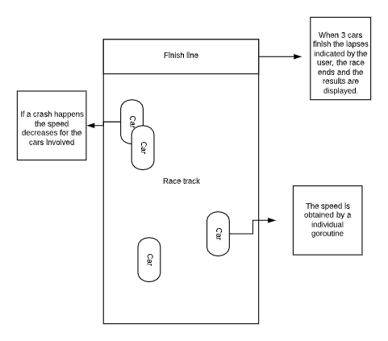

# GrandPrix Architecture Overview

### Programming Language: Golang
#### Team Members :
* Juan José González Basilio

************************

City Traffic Simulator has a ?? based architecture. It consists of ##.go files that will be described bellow.

[GrandPrix.go](GrandPrix.go)
- Main file, it contains the calls for the rest of the program.

***************************
### Diagram

The following graph was used for the race track structure.

***************************
### Libraries
- Pixel: A hand-crafted 2D game library in Go (Installation notes on [GRAND_PRIX.md](GRAND_PRIX.md))

### City Traffic Simulator prerequisites:
- Have Golang installed.
- Run on a bash terminal.
- Pixel
- OpenGL